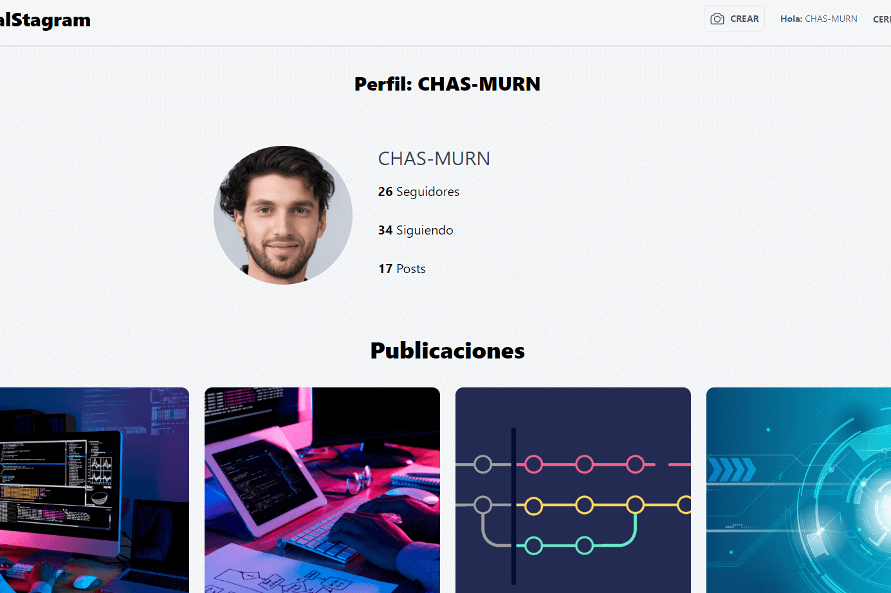

# _VISUAL STAGRAM_

-   **DESCRIPTION :**

    Visual Stagram is a cutting-edge social networking platform tailored specifically for software developers. Designed with the developer community in mind, Visual Stagram provides a vibrant space for programmers to connect, share insights, and collaborate on projects. With intuitive user interfaces and robust features, developers can effortlessly showcase their coding projects, exchange ideas, and seek feedback from peers. Whether you're a seasoned professional or just starting your coding journey, Visual Stagram offers a dynamic environment to network, learn, and grow as a developer. Join Visual Stagram today and unlock a world of opportunities to connect with like-minded individuals and advance your coding skills.

---

-   **INSTALLATION REQUIREMENTS :**

    -   **Composer**
    -   **Node.js**
    -   **XAMPP**
    -   **Activate Zip at PHP.ini**

---

-   **INSTALLATION INSTRUCTIONS :**

    **1. composer install `visual-stagram`** 
    **2. npm install `visual-stagram`** 
    **4. Create DB** 
    **5. Config `visual-stagram/.env`** 
    **6. php artisan migrate `visual-stagram`** 
    **7. npm run dev `visual-stagram`** 

---

-   **STACK :**

    -   **Visual Stagram** : `1.0.1`
    -   **Vite** : `4.0.0`
    -   **Laravel** : `10.10.0`
    -   **TailwindCSS** : `3.3.5`
    -   **Dropzone** : `6.0.0`

---

-   **CREDITS :**

    -   **Author : [David Gómez](https://github.com/DavidGomezToca)**
